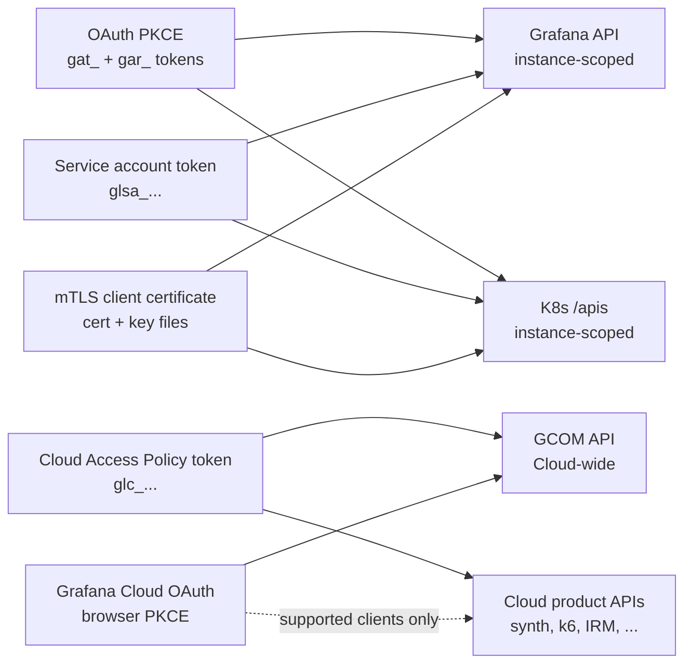
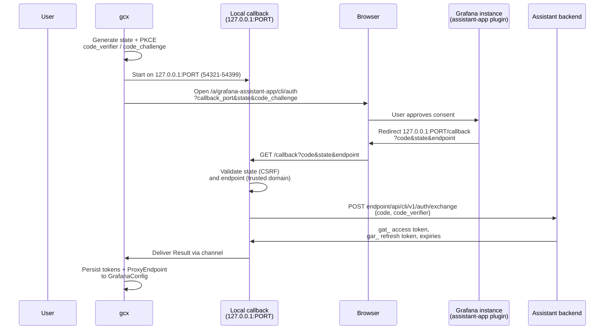
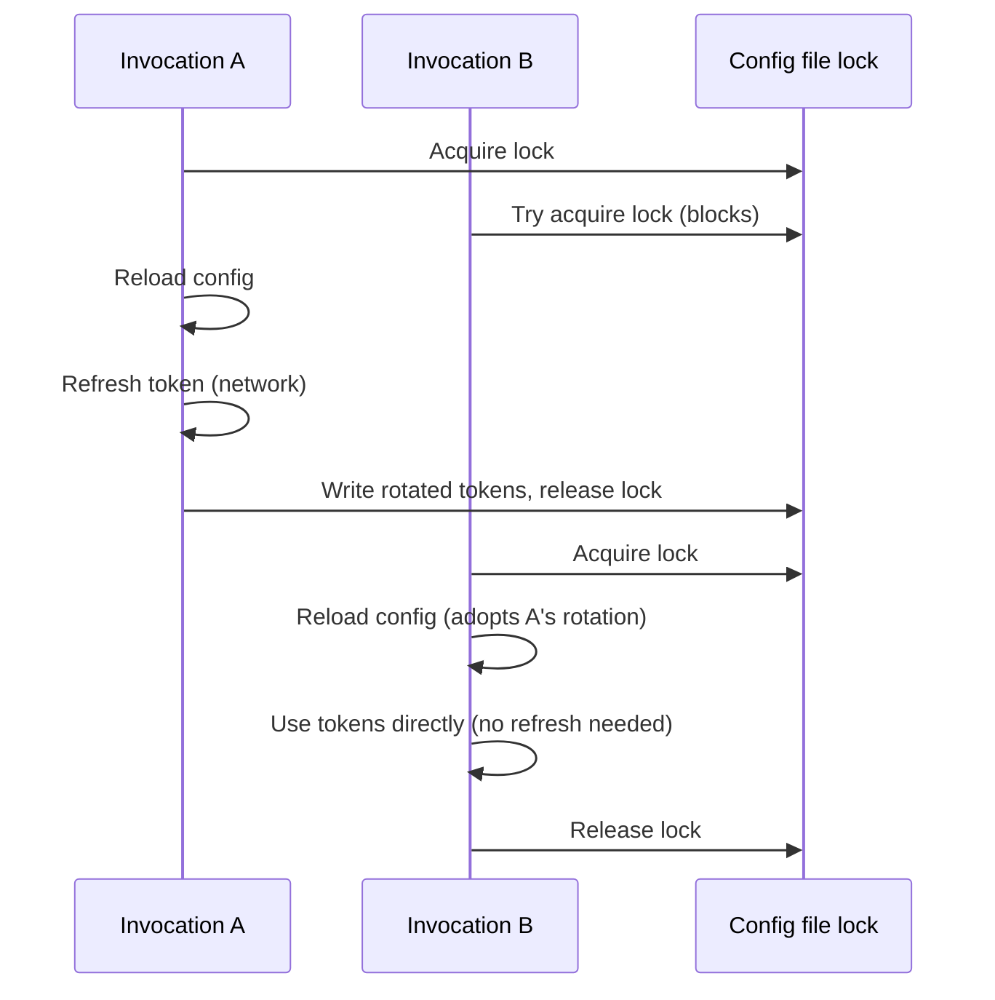

# Authentication Subsystem

## Overview

gcx supports Grafana OAuth (PKCE), Grafana service account tokens, mTLS client
certificates, Grafana Cloud Access Policy tokens, and direct Grafana Cloud
OAuth. Each targets a specific API surface. The
authentication subsystem spans package boundaries: OAuth mechanics live in
`internal/auth/`, token storage lives in `internal/config/` as fields on
`GrafanaConfig` and `CloudEntry`, TLS certificate settings live in
`GrafanaConfig.TLS`, and token/cert attachment to HTTP clients happens in
`internal/config/rest.go`. This document covers those methods end to end.



---

## Auth methods at a glance

| Method | Target | Provisioning | Storage field | Refresh | Rotation |
|---|---|---|---|---|---|
| OAuth PKCE | Grafana API, K8s `/apis` | Browser flow via `gcx login` | `GrafanaConfig.OAuthToken`, `OAuthRefreshToken`, `OAuthTokenExpiresAt`, `OAuthRefreshExpiresAt`, `ProxyEndpoint` | Automatic via `RefreshTransport` | Transparent |
| Service account token | Grafana API, K8s `/apis` | Grafana UI → Administration → Service accounts | `GrafanaConfig.APIToken` | None (static) | Manual (rotate in Grafana UI) |
| mTLS client certificate | Grafana API, K8s `/apis` | Identity-aware proxy (e.g. Teleport) | `GrafanaConfig.TLS.CertFile`, `KeyFile`, `CAFile` (or `CertData`, `KeyData`, `CAData`) | External (proxy manages cert lifecycle) | External (e.g. `tsh apps login`) |
| Cloud Access Policy token | GCOM, Cloud product APIs | Grafana Cloud UI → Security → Access policies | `CloudEntry.Token` | None (static) | Manual (rotate in Cloud UI) |
| Grafana Cloud OAuth | GCOM and supported Cloud product clients (experimental; not full CAP parity) | Browser flow via `gcx cloud login` or the Cloud step in `gcx login` | `CloudEntry.OAuthToken`, `OAuthTokenExpiresAt`, `OAuthScopes`, `OAuthUrl`, `APIUrl` | None | Re-run Cloud login on expiry |

---

## Grafana auth selection

For versioned contexts, `GrafanaConfig.AuthMethod` is authoritative unless a
non-blank `GRAFANA_TOKEN` supplies a complete service-account credential for
the current invocation. That environment override selects token mode only in
the resolved runtime context; it does not rewrite the persisted `auth-method`.
Otherwise exactly the persisted method is attached to requests: OAuth does not
reuse a stale service account token, token and Basic modes do not reuse stale
OAuth fields, and an explicit non-mTLS method does not present a stale client
certificate. Server trust settings such as CA data, SNI, and
`insecure-skip-verify` still apply.

`GRAFANA_PASSWORD` can replace the password of a context already selecting
Basic authentication, but it does not select Basic mode by itself. A password
without a deliberate user/method selection is not a complete credential and
must not let ambient process state override OAuth, token, or mTLS.

Legacy contexts with no `auth-method` retain compatibility inference in this
order: OAuth proxy, service-account token, Basic, then mTLS or anonymous. A
partial or rejected higher-priority credential is evidence that authentication
was configured, so it fails before network use rather than falling through to a
lower-priority or empty credential. OAuth requires a proxy endpoint plus an
access or refresh token; refresh-only OAuth is valid. Explicit token, Basic,
and mTLS modes require their complete selected credential material.

All Grafana request paths use the same selector and selected TLS view. Bespoke
clients must call `Context.EffectiveGrafanaAuthMethod` and
`Context.EffectiveGrafanaTLS`, or reuse `Context.ToRESTConfig`; they must not
inspect populated credential fields to invent their own precedence.

---

## Service account tokens

Service account tokens are static bearer credentials issued by a Grafana
instance. Users provision them through the Grafana UI under Administration →
Service accounts; the token carries the scope of its account (Editor, Admin,
or custom role). Tokens are prefixed `glsa_`.

gcx stores them in `GrafanaConfig.APIToken` (`datapolicy:"secret"`, redacted
in `gcx config view`). The REST config builder in `internal/config/rest.go`
sets them as `rest.Config.BearerToken` when token auth is selected.

Rotation is manual: rotate in the Grafana UI, then update the context with
`gcx login --context X --token glsa_new_token`.

---

## mTLS client certificates

mTLS (mutual TLS) authentication uses client certificates to authenticate at
the transport layer. This is the standard method for Grafana instances behind
identity-aware proxies like [Teleport](https://goteleport.com/), where the
proxy terminates mTLS and authenticates the user based on the client
certificate — no Grafana token is needed.

gcx stores the certificate paths in `GrafanaConfig.TLS` (`CertFile`,
`KeyFile`, optionally `CAFile`), or inline as `CertData`/`KeyData`/`CAData`.
Environment variables `GRAFANA_TLS_CERT_FILE`, `GRAFANA_TLS_KEY_FILE`, and
`GRAFANA_TLS_CA_FILE` are supported for CI/CD.

### Configuration

```bash
# Via gcx config
gcx config set stacks.myctx.grafana.server https://grafana.teleport.example.com
gcx config set stacks.myctx.grafana.tls.cert-file "$(tsh apps config grafana -f cert)"
gcx config set stacks.myctx.grafana.tls.key-file "$(tsh apps config grafana -f key)"
gcx config set contexts.myctx.stack myctx

# Login detects mTLS as the auth method
gcx login --yes
```

### How it works

The login flow detects mTLS as a standalone auth method when
`GrafanaConfig.TLS` has a client certificate configured and no token or OAuth
credentials are provided. The `AuthMethod` is stored as `"mtls"`. TLS
settings are threaded through the entire login pipeline: target detection,
connectivity validation, and health checks all use TLS-aware HTTP clients.

On re-auth (`gcx login` against an existing context), the CLI carries
existing TLS settings forward so the user does not need to re-specify
certificate paths. `mergeAuthIntoExisting` syncs TLS alongside other auth
fields.

Certificate lifecycle is managed externally (e.g. `tsh apps login grafana`
refreshes short-lived certs). gcx captures the files while resolving the
credential-bearing config and builds the transport from those captured bytes,
so a path swap cannot change the certificate between trust validation and use;
refreshed certs take effect on the next command. Because certificate and key
files are external credentials, an auto-discovered repository `.gcx.yaml`
cannot select them. Use `--config .gcx.yaml` or `GCX_CONFIG` to authorize that
file explicitly.

---

## Cloud Access Policy tokens

Cloud Access Policy tokens are static bearer credentials issued by Grafana
Cloud. Users provision them in the Cloud UI under Security → Access policies;
the token carries the scope of the policy (metrics read, logs write, IRM
admin, etc.). Tokens are prefixed `glc_`.

gcx stores them in `CloudEntry.Token` (`datapolicy:"secret"`). They are
attached to two different API surfaces: the GCOM API (via the
`internal/cloud/` client) and Cloud product APIs (via product-specific REST
clients for synth, k6, IRM, fleet, and others).

Rotation is manual: rotate the access policy in the Cloud UI, then update
the context with `gcx login --context X --cloud-token glc_new_token`.

## Grafana Cloud OAuth

The Cloud login flow is a separate PKCE exchange from Grafana instance OAuth.
It mints a GCOM credential and stores it in `CloudEntry.OAuthToken`, along with
the issuer-provided expiry and granted scopes. The entry also stores both the
OAuth origin and API destination. A unified login uses the same environment
for both unless the caller explicitly supplies both endpoints, so a token is
not minted against production and then saved for a development or operations
environment.

`CloudEntry.Token` and `CloudEntry.OAuthToken` are distinct credential kinds;
setting one clears the other. Re-authentication that keeps an existing
credential preserves its kind, expiry, scopes, and endpoints. Expired OAuth
credentials cannot be kept and must be replaced through the browser flow.

Unlike Grafana instance OAuth, direct Cloud OAuth has no refresh token. Cloud
API loading checks `OAuthTokenExpiresAt` when present and tells the user to run
`gcx cloud login` after expiry. The flow is experimental: GCOM and some Cloud
product clients accept the resulting bearer token, but commands that have not
yet gained OAuth support still require a CAP.

---

## OAuth PKCE flow

OAuth PKCE is the default for interactive users on Grafana Cloud. The flow
spans three remote actors: the Grafana instance (which hosts the
`grafana-assistant-app` plugin and renders the consent UI), the assistant
backend (which issues and refreshes tokens), and a short-lived callback
server that gcx starts on a loopback port.



PKCE (Proof Key for Code Exchange, RFC 7636) protects against intercepted
authorization codes: the `code_verifier` never leaves gcx, so an attacker who
captures the authorization code cannot exchange it for a token without also
knowing the verifier. The callback binds to a loopback address (default
`127.0.0.1`) because browser vendors treat loopback URIs as secure contexts
for OAuth redirects without requiring custom URI schemes. The port is picked
from the range `54321-54399`.

Two extra safeguards sit inside the callback handler. The `state` parameter
is generated by gcx and re-checked on return, which closes the classic CSRF
hole. The `endpoint` query parameter — supplied by the assistant plugin and
used as the base URL for the token exchange — is validated by
`ValidateEndpointURL` against a short list of trusted Grafana suffixes
(`.grafana.net`, `.grafana-dev.net`, `.grafana-ops.net`) plus loopback. This
prevents an attacker who controls the browser redirect from steering the
token exchange at a hostile host.

The token exchange response carries an `api_endpoint` field, stored as
`GrafanaConfig.ProxyEndpoint`. All subsequent API traffic is routed through
that endpoint (see OAuth proxy routing below). Exact implementation lives in
`internal/auth/flow.go`.

---

## Token lifecycle

| Method | Lifecycle |
|---|---|
| OAuth PKCE | Dynamic. The `gat_` access token has a short expiry; the `gar_` refresh token has a longer one. `RefreshTransport` renews the access token when a request sees credentials inside the 5-minute refresh threshold (`refreshThreshold` in `internal/auth/transport.go`), and the successful refresh generation is persisted back to the config file. An access token with no issuer-reported expiry is used as an opaque bearer without an immediate proactive refresh. |
| Service account token | Static. Lives until manually rotated in the Grafana UI. gcx treats it as an opaque bearer credential. |
| Cloud Access Policy token | Static. Lives until manually rotated in the Grafana Cloud UI. |
| Grafana Cloud OAuth | Dynamic but not refreshable. gcx retains issuer-reported expiry and scopes; after expiry, re-run `gcx cloud login` or the Cloud step in `gcx login`. |

All token fields are tagged `datapolicy:"secret"` and redacted by
`internal/secrets/` when `gcx config view` runs. See
[config-system.md](config-system.md) for the redaction implementation.

---

## RefreshTransport

`RefreshTransport` in `internal/auth/transport.go` is an `http.RoundTripper`
wrapper that intercepts outbound requests, detects access-token expiry,
performs a refresh inline, and forwards the original request with the new
bearer. It plugs into k8s `client-go` via `rest.Config.WrapTransport`.

A notable design choice: when `RefreshTransport` is active,
`rest.Config.BearerToken` is left empty. Setting it would cause `client-go`
to add a second authorization layer that would conflict with the refresh
logic. The transport also skips its own auth if the incoming request already
carries an `Authorization` header, letting providers pass through BasicAuth
credentials for datasource queries.

Refresh itself is serialized in two layers. Within a single process, all
concurrent callers join one explicit in-flight refresh result.
Across processes, a `TokenLocker` hook holds a file lock on the config file
for the duration of the refresh. The network POST to `/api/cli/v1/auth/refresh`
uses a context detached from the caller's request context so that a caller
cancellation cannot abandon a refresh that has already consumed and rotated
the server-side refresh token. Cancellation is still honored before the lock
and network request begin.

A successful refresh response is not exposed to protected requests until
persistence succeeds. Rotation-capable issuers may return a new refresh token;
non-rotating issuers may return the same generation. If persistence fails, the
process retains one pending generation and retries that write without issuing
a second refresh.
Persistence compares the previous refresh token with the current on-disk
generation, treats an identical already-written generation as success, and
never overwrites a newer login or refresh. Before either reload or persistence,
it also compares the complete OAuth credential binding captured by the active
transport: source, owner, field, server, proxy, TLS options, and the captured
bytes of file-backed TLS material. A concurrent trust change therefore cannot
adopt the rotated generation. If the unchanged bound keychain reference is
temporarily unavailable or its account is missing, gcx cannot prove that
another generation won: it fails closed and retains the pending generation for
a later persistence retry. The pending record is process-local, so a process
crash after server-side rotation but before durable persistence can still
require re-authentication.

HTTP 200 is not sufficient evidence of a valid refresh. gcx requires nonempty
access and refresh tokens. Expiry timestamps are optional; a blank timestamp is
persisted as unknown, while every nonblank timestamp must be valid RFC3339.
Returning the same nonempty refresh token is a supported non-rotating response.
A malformed response with no usable refresh generation blocks that transport
without retrying the consumed token. If a nonempty generation is present
alongside another validation error, gcx first persists a forced-stale recovery
generation and then returns the validation error. A later process can retry
safely; the process that observed the malformed response remains blocked so it
cannot accidentally send an invalid access token or refresh twice.

---

## OAuth proxy routing

Cloud OAuth traffic does not go directly to the Grafana stack. It is routed
through the assistant backend, reached at
`https://<assistant>/api/cli/v1/proxy/*`. `rest.Config.Host` is rewritten to
that proxy URL at REST-config build time (`NewNamespacedRESTConfig` in
`internal/config/rest.go`), while a separate field
`NamespacedRESTConfig.GrafanaURL` preserves the original stack URL for
user-facing deep links (dashboard browser links, for example).

The proxy exists because Cloud OAuth tokens are scoped to the assistant
application, not the stack directly. The proxy exchanges the bearer
credential for stack access on each request.

---

## Concurrent-invocation safety

Multiple parallel `gcx` invocations can race on refresh-token rotation: the
first to refresh invalidates the old refresh token, which would cause later
callers to fail with a 401 and be locked out. gcx handles this with
cross-process file locking and coordinated token reloading in
`WireTokenPersistence` (`internal/config/rest.go`). At refresh time, the
`RefreshTransport` acquires a file lock on the config file, reloads it to
see any rotation that happened between request start and refresh time, skips
the network call if the on-disk tokens are already fresh, otherwise performs
the refresh and persists the new tokens before releasing the lock.



---

## File pointers

```
internal/auth/
  flow.go             OAuth PKCE flow, callback server, exchange,
                      state/endpoint validation
  gcom.go             Direct Grafana Cloud OAuth PKCE flow and response metadata
  transport.go        RefreshTransport, StoredTokens, TokenRefresher,
                      TokenLocker, TokenReloader, DoRefresh

internal/config/
  types.go            APIToken (SA token), CloudEntry CAP/OAuth fields,
                      expiry/scopes, Grafana OAuth fields, ProxyEndpoint
  rest.go             Bearer attachment, WrapTransport wiring,
                      NewNamespacedRESTConfig, WireTokenPersistence,
                      ResolveTokenPersistenceSource

internal/auth/adaptive/
  — out of scope for this document (used by signal providers for
     adaptive telemetry auth). Follow-up documentation tracked separately.
```

---

## See also

- [Login system](login-system.md) — how the login orchestrator uses this subsystem.
- [Configuration and context system](config-system.md) — where tokens are stored and how secrets are redacted.
- [Login reference (user-facing)](../reference/login.md) — user-facing auth-method walkthroughs.
- [ADR 001: Login + config consolidation](../adrs/login-consolidation/001-login-config-consolidation.md) — historical rationale, including OAuth-proxy decision.
